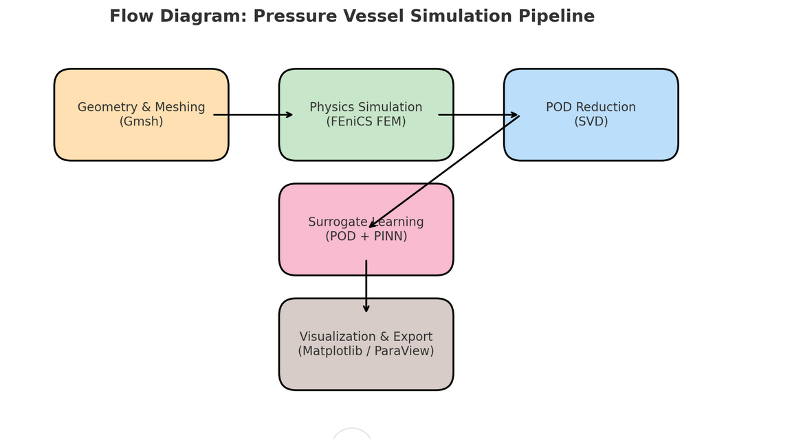

# Pressure Vessel POD + Neural Network Surrogate (Small Mesh Demo)


## Overview

This project demonstrates an **open-source** workflow for simulating and building a **physics-informed AI surrogate** for a cylindrical pressure vessel under internal pressure.  
We replace commercial FEA tools like ANSYS with **FEniCS** (for physics-based simulation) and combine it with **Proper Orthogonal Decomposition (POD)** and a **Neural Network** for rapid prediction of deformation fields.

The pipeline:
1. Generate a **small 3D hollow cylinder mesh** with **Gmsh**.
2. Run **FEniCS** to solve linear elasticity with varying parameters (Young’s modulus `E` and pressure `p`).
3. Build a **snapshot matrix** from displacement results.
4. Apply **POD** to extract a low-dimensional basis.
5. Train a **PyTorch NN** to map `(E, p)` → POD coefficients.
6. Reconstruct the displacement field from NN predictions.
7. **Compare** NN results vs. FEniCS results with:
   - Error histograms
   - 3D scatter plots of spatial error
   - ParaView `.xdmf` output for full visualization.

This example uses a **coarse mesh** to keep runtimes low (~seconds per simulation), but can be adapted to high-resolution meshes for production.

---

## Files

- `pressure_vessel_pod_nn.ipynb` – Complete runnable Jupyter notebook with explanations.
- `pressure_vessel_pod_nn.py` – Script version (same logic, easier CLI execution).
- `requirements.txt` – Python dependencies.
- *(Generated after running the notebook)*:
  - `vessel.msh`, `vessel_mesh.xdmf`, `vessel_facets.xdmf` – Mesh files.
  - `ground_truth.xdmf` – FEniCS displacement field for chosen parameters.
  - `nn_prediction.xdmf` – Neural network predicted displacement field.
  - `error_field.xdmf` – Absolute displacement error magnitude field.

---

## Dependencies

Install everything with:
```bash
pip install -r requirements.txt
```

Requirements:
- `fenics==2019.1.0` – Physics-based finite element solver.
- `gmsh` – Mesh generation.
- `meshio` – Mesh format conversion.
- `torch` – Neural network training.
- `numpy`, `scikit-learn`, `matplotlib` – Data handling and visualization.

---

## How to Run

### 1. Jupyter Notebook
```bash
jupyter notebook pressure_vessel_pod_nn.ipynb
```
Run all cells to:
- Generate mesh
- Solve PDE for multiple `(E, p)` combinations
- Perform POD
- Train NN
- Output ParaView-ready results

### 2. Python Script
```bash
python pressure_vessel_pod_nn.py
```
This will execute the same pipeline without interactive plots.

---

## Visualization in ParaView

Three `.xdmf` files are saved for ParaView:
- **Ground Truth**: `ground_truth.xdmf`
- **NN Prediction**: `nn_prediction.xdmf`
- **Error Field**: `error_field.xdmf`

To view:
1. Open `.xdmf` file in ParaView and click *Apply*.
2. Use "Surface" or "Warp By Vector" to view displacements.
3. Color by displacement magnitude or error magnitude.
4. Compare ground truth vs NN visually.

---

## Notes

- This is a **demo mesh** with coarse resolution for fast runs.  
  Replace `lc` in the mesh generation step for finer accuracy.
- Extensible to nonlinear materials, thermal loading, or dynamic simulations.
- The POD+NN framework can be swapped for other reduced-order models (e.g., GP regression).

---

## License

This project is licensed under the MIT License - see the [LICENSE](LICENSE) file for details.


---
